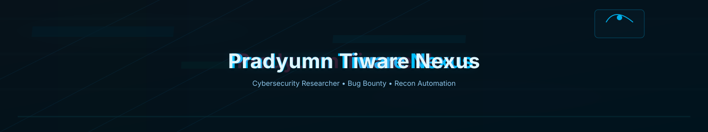

  

  

<h1 align="center">Hi! I'm Pradyumn Tiware Nexus 👋</h1>

  <b>Cybersecurity Researcher • Bug Bounty Hunter • Recon Automation Developer</b>

  <a href="https://pradyumntiwarenexus.github.io/" target="_blank">🔗 Portfolio</a> • 
  <a href="https://github.com/PradyumnTiwareNexus/All-in-one-recon" target="_blank">🧩 All-in-one-recon</a> • 
  <a href="mailto:your-email@example.com">✉️ Contact</a>

---

## 👤 More about me  
- 🔎 **Specialties:** Recon Automation, OSINT, Web Security, Bug Bounty  
- 🛠️ **Tools I use:** Burp Suite, Nmap, Subfinder, httpx, nuclei, Gau, Wayback  
- 💻 **Languages:** Python • Bash • JavaScript • C/C++  
- 🌱 **Currently:** Building advanced recon automation & improving All-in-one-recon (v2.1)  
- 🏆 **Hobbies:** Bug hunting, CTFs, reading security writeups  

---

## 🧠 Knowledge & Skills

<!-- Line 1 -->

 

<!-- Line 2 -->

 

<!-- Line 3 -->

 

<!-- Line 4 -->

## 📫 Connect

  <a href="https://github.com/PradyumnTiwareNexus" target="_blank">🐙 GitHub</a> • 
  <a href="https://pradyumntiwarenexus.github.io/" target="_blank">🌐 Website</a> • 
  <a href="https://twitter.com/your_twitter" target="_blank">🐦 X/Twitter</a> • 
  <a href="mailto:your-email@example.com">✉️ Email</a>

---

## 📊 GitHub Stats

  <!-- GitHub Stats -->
  

  <!-- Top Languages -->
  

---

## 🔥 GitHub Streak

  

---

## 🏆 GitHub Trophies

  

---

⭐ If you like my projects, consider giving a star!

